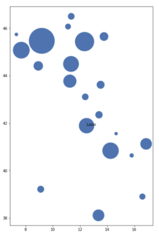

    # 1-COVID
## Gruppo 
### Nome del gruppo
    - Linus_Torvalds_Group
### Partecipanti
    - Di Battista Mattia
## Scopo del progetto
Usando i dati della protezione civile italiana riguardante l'andamento delle infezioni da COVID-19 (vedi https://github.com/pcm-dpc/COVID-19).
Costruire funzioni per:
 - Graficare con un grafico a bolle geolocalizzato l'andamento di una osservabile scelta per una data scelta (vedi figura qui sotto), la dimensione della bolla rappresenta il valore della osservabile opportunamente scalato, mentre la posizione della bolla la geolocalizzazione della regione. 
 - Calcolare e graficare per ogni data dell'andamento nazionale il rapporto nuovi_positivi e nuovi_tamponi dove nuovi_tamponi è una colonna calcolata rappresentante il numero di nuovi tamponi effettuati (da calcolare).
 - Calcolare per ogni data dell'andamento regionale il rapporto tra nuovi_positivi e nuovi_tamponi dove nuovi_tamponi è una colonna calcolata rappresentante il numero di nuovi tamponi effettuati (da calcolare).
 - Calcolare e graficare la media mobile a 7 giorni per l'andamento nazionale.
## Dati
 - nuovi positivi
 - tamponi
 - latitudine
 - longitudine